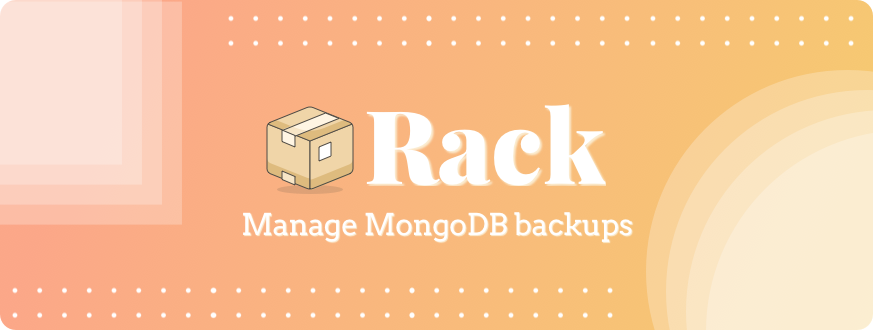

<!--
[](http://bit.ly/Share-Lumie-twitter)
-->



## 🤔 DESCRIPTION

Rack is a tool to help you to manage mongoDB databases with ease.

✅ Import / Export
✅ Manage BDDs of multiples environments. ( see usecases )
✅ AWS S3 support *( soon )*
✅ Setup CRON *( soon )*


## 💾 INSTALLATION

```bash
npm install rack
```

## 🔩 HOW IT WORKS

**Rack** must be launch from a folder which contains `.rackfile.json`. The purpose of Rack it to adapt to different projects.
```bash
rack
```

``` json
{
    "backup-path": "./backup",
    "hosts": {
        "development": {
            "url": "localhost:27018",
            "fileExtention": "dev",
            "username": "",
            "password": "",
            "databases": ["bdd1", "bdd2"]
        },
        "staging": {
            "url": "...:27018",
            "fileExtention": "sta",
            "username": "",
            "password": "",
            "databases":  ["bdd1"]
        },
        "production": {
            "url": "...:27018",
            "fileExtention": "prod",
            "username": "",
            "password": "",
            "databases": ["bdd1"]
        }
    }
}
```

## 🚀 ROADMAP

Here are the next features planned, let me know if you have some ideas

* Setup CRONs
* AWS S3 support


## ☕️ SUPPORT
You can support the project by
* Star our GitHub repo ⭐️
* [Suggest ideas](https://github.com/Alex-Levacher/Rack/issues) to help me improve Rack 🌎

If you are struggling to setup Rack, you found a bug or if you have some improvement ideas, feel free to [create an issue](https://github.com/Alex-Levacher/Lumie/issues)<br><br>
<a href="https://www.buymeacoffee.com/AlexLevacher" target="_blank"></a>

## ⚖️ LICENSE

This software is licensed under the MIT © [Alex Levacher](mailto:levacher.alex@gmail.com)
